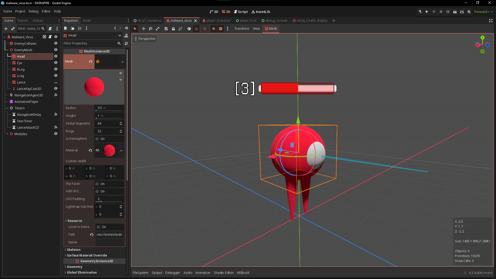
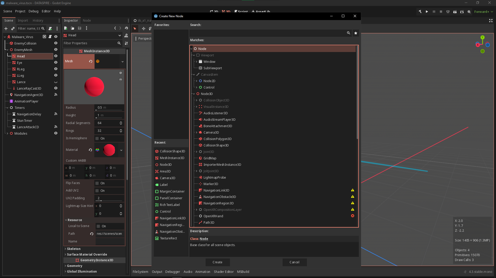
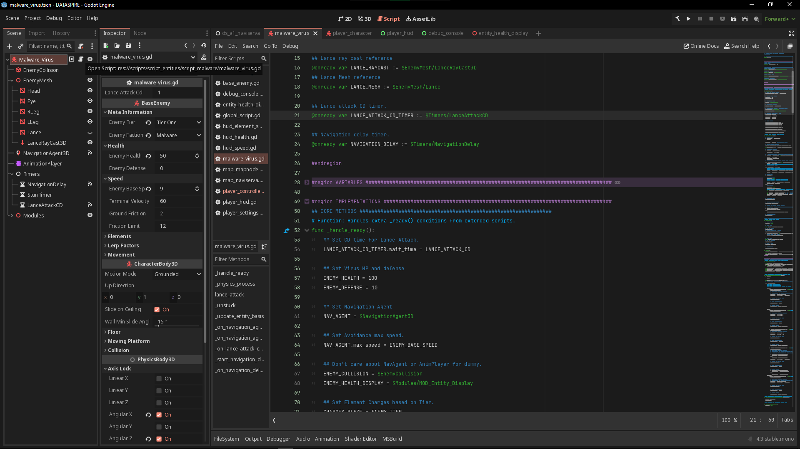
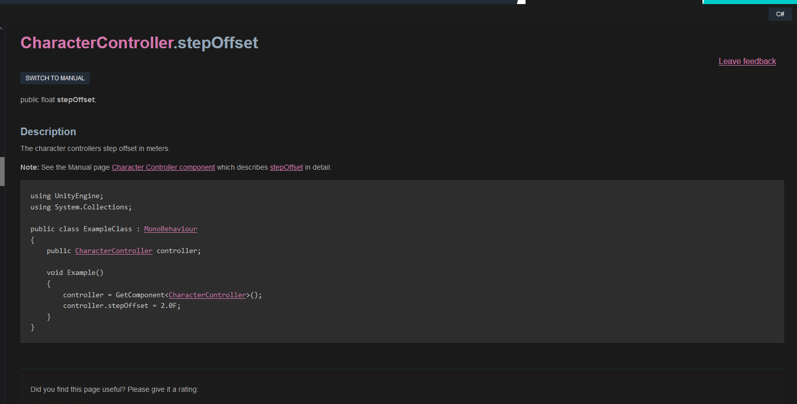
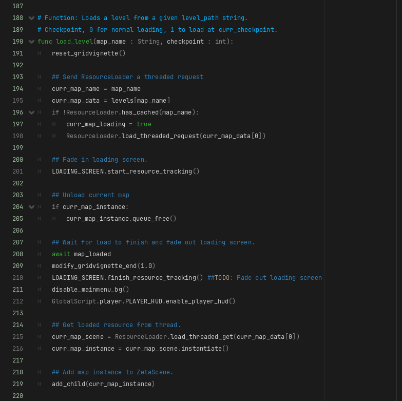
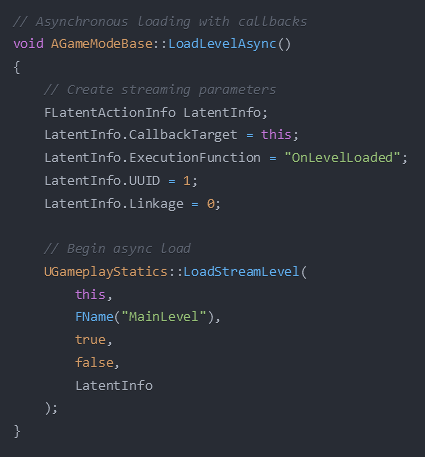

## Abstract

This project evaluated whether Godot is a viable engine for 3D game development compared to Unity and Unreal Engine. Over roughly one year a two person team built DATASPIRE, a 3D first person action platformer, in Godot as the primary study subject, and built comparable test builds in Unity and Unreal to compare specific implementations against. The comparison covers three areas in depth (engine architecture, stair-stepping, and level loading) plus the cost of running each engine. The conclusion is that Godot is a viable choice for 3D development, particularly for small teams and newcomers, but that it is missing implementations which are standard in the older engines, and that its tutorial ecosystem lags well behind its documentation.

---

## Questions

1. How does each engine structure a game, and what does that cost the developer?
2. How does implementing player stair-stepping compare between Godot and Unity?
3. How does implementing level loading compare between Godot and Unreal Engine?
4. What does it cost to run and to license each engine?

## Engines

| Engine | Version used | Primary language | Source model | Released |
|---|---|---|---|---|
| Godot | 4.2.2, upgraded to 4.3 during development | GDScript (also C#, C++) | Open source, MIT | Godot 4.0 in March 2023 |
| Unity | 2023.1.13f1 | C# | Proprietary | Unity 2023 |
| Unreal Engine | 5.3 | C++ and Blueprints | Source available | UE5 in April 2022 |

The Godot upgrade from 4.2.2 to 4.3 happened on 19 August 2024, partway through development. It does not affect the comparison, because none of the features introduced in 4.3 were adopted. The upgrade did break existing shaders and player gravity calculations, which is recorded in the project log.

## Evidence

Godot claims in this writeup come from a year of daily use and are backed by a dated project log. Unity and Unreal claims come from comparable test builds made for specific implementation comparisons, plus each engine's official documentation. Those test builds did not survive the project; only the qualitative findings and notes did. Where a claim rests on documentation rather than on something built, that is stated.

---

## Question 1: Engine Architecture

All three engines solve the same problem, which is how to compose a game object out of reusable parts. All three arrived at a similar answer using different vocabulary. Where they genuinely differ is in how much structure the engine imposes before any code is written.

| | Godot | Unity | Unreal Engine |
|---|---|---|---|
| Base object | Node | GameObject | UObject, then Actor |
| Behaviour attaches via | Child nodes and scripts | Components | Components |
| Container or level | Scene | Scene | Level, inside a World |
| Reusable prefabricated unit | Scene (instanced) | Prefab | Blueprint Class |
| Scripting | GDScript, C#, C++ | C# via MonoBehaviour | C++ and Blueprints |

### Godot: nodes and scenes

Godot's documentation calls nodes "the fundamental building blocks of your game", and states that "together, nodes form a tree". A node does exactly one job: draw a mesh, hold a collision shape, drive a camera, navigate a mesh, run a timer. Behaviour is built by composing nodes into a tree and attaching scripts to them.

A group of nodes saved together becomes a Scene, and scenes nest inside other scenes. The documentation states that "scenes work like new node types in the editor, where you can add them as a child of an existing node". A scene always has one root node, and can be instanced as many times as needed.



The screenshot above is the Virus enemy from DATASPIRE. The Scene Tree on the left shows the whole pattern in one frame: a root node (Malware_Virus) carrying the script that defines the enemy's behaviour, with child nodes supplying collision (EnemyCollision), geometry (EnemyMesh, with Head, Eye, RLeg, LLeg and Lance beneath it), pathfinding (NavigationAgent3D), animation (AnimationPlayer), and a group of Timers controlling navigation delay, stun, and attack cooldown. The entire enemy can then be dropped into a level as a single unit.



Every element in that tree is the same kind of thing. There are 2D nodes, 3D nodes, Control nodes for interface work, and a long tail of specialised ones, but they compose identically.



Scripts specialise nodes. The variables at the top of the Virus script hold references to nodes within the scene tree, which is what allows nodes to be used or modified programmatically.

What this is good at: there is exactly one concept to learn. A level, a menu, a HUD, an enemy and a weapon are all trees of nodes. Nothing is a special case. For a two person team with no prior engine experience, that uniformity was the single largest reason we stayed productive.

What it costs: deep node trees become unwieldy, and because a script lives on a node rather than in a separate behaviour layer, the question "where does this logic belong" gets answered by tree position. DATASPIRE ended up with three global singletons (PlayerSettings for controls and graphics, GlobalScript for game state, and ZetaScene for interface elements and level loading) precisely because some state does not belong to any node in particular.

### Unity: GameObjects and Components

Unity separates the container from the behaviour more sharply than Godot does. The Unity manual is explicit that a GameObject is only a container: "a GameObject can't do anything on its own; you need to give it properties before it can become a character, an environment, or a special effect". GameObjects "act as containers for Components, which implement the functionality".

Where Godot specialises an object by adding a child node, Unity specialises it by adding a component to the same object. Every GameObject carries a mandatory Transform component which cannot be removed. Custom behaviour comes from C# scripts deriving from MonoBehaviour, attached as components.

### Unreal Engine: UObjects, Actors and Components

Unreal has the deepest hierarchy of the three. UObject is the shared base class for most classes in the engine, providing garbage collection, reflection metadata, and serialisation.

Actor subclasses UObject and is the thing placed in a level. Epic's own documentation draws the cross-engine comparison directly, describing Actor as "a close equivalent to Unity's GameObject". Actors contain one or more Components, can be spawned at runtime, and support network replication.

Unreal then splits components in a way neither other engine does. An Actor Component has no transform and exists for abstract behaviour such as inventory or attribute management. A Scene Component adds a transform, for anything that needs a position in the world. Actors live in Levels, and Levels live in a World.

Unreal also offers two authoring surfaces over the same class system: C++ and Blueprints, a node based visual scripting system. A C++ class can be written first and a Blueprint class derived from it.

### What the comparison actually shows

These are three spellings of one idea. Anyone who understands node and scene can read GameObject and Component, or Actor and Component, without much friction. Epic says as much itself.

The real difference is how much structure each engine imposes before any code is written. Godot imposes almost none: one concept, composed freely. Unreal imposes the most, being a gameplay framework of specific classes with defined roles plus a second authoring language. Unity sits between them.

For a student team, Godot's low imposed structure was an advantage, because something could be built without first learning a framework. For a large team working to a deadline the same property becomes a liability, because Unreal's imposed structure is the shared vocabulary that lets many people work on one codebase. This project was not in a position to test that second claim and does not make it.

---

## Question 2: Stair-stepping, Godot against Unity

Stair-stepping allows a player character to walk up a stepped surface without colliding into it and stopping. It sounds trivial. It was the clearest engine feature gap encountered during the entire project.

### Unity

Unity ships stair-stepping as a property of its built in character controller. The developer sets a maximum step height and the controller handles the rest.



The property is a public float, set in a single line:

```csharp
controller.stepOffset = 2.0F;
```

### Godot

Godot has no native stair-stepping, and there was no reference implementation to copy. The community proposal for the feature, godot-proposals issue 2751, titled "Add automatic smooth stairs step-up and step-down for CharacterBody using move_and_slide()", was opened on 20 May 2021. Checked again on 17 August 2026, it remains open. That is more than five years without a settled engine level implementation.

What the proposal asks for is an optional step_height parameter on move_and_slide(). It is a request for Unity's stepOffset, more or less exactly. The gap is well understood by Godot's own community; it simply has not been closed.

### What we built

DATASPIRE needed stair-stepping, so we implemented it ourselves and then reworked it. The approach used a two node collision hitbox, five raycasts, and calls to body_test_move to test candidate positions, with camera smoothing applied so the step does not read as a jolt. The initial motivation for a custom approach was that Godot's SeparationRay shapes behaved inconsistently under the Jolt Physics addon, which the project used for more deterministic 3D physics.

The project log records the rework on 26 February 2024: "Movement system rework #1 complete. Notably, the stair-stepping functionality was updated."

We published the implementation as an open source demo project on GitHub at [JheKWall/Godot-Stair-Step-Demo](https://github.com/JheKWall/Godot-Stair-Step-Demo) and on the Godot Asset Library, and contributed our implementation notes to the [proposal thread](https://github.com/godotengine/godot-proposals/issues/2751) on 6 January 2024.

### The edge case, and a correction we published

A follow up comment on 25 February 2024 documented a problem with the approach. When stepping onto a walkable slope from the side rather than head on, the character collides with the corner of the slope first, so body_test_motion returns the normal of the corner rather than the normal of the slope. The slope being tested was 45 degrees, matching floor_max_angle, but the corner collision returned roughly 53.8 degrees, which the code then rejected as too steep to walk on.

The first fix was to test the slope against a raised maximum floor angle to absorb the discrepancy. That fix was published, then struck through in the same comment with the reason it was wrong: it allowed the player to walk up genuinely steep slopes when approaching head on. The replacement was to use a non rotating BoxShape3D as the player's collision shape, which resolves the axis aligned case. The remaining limitation, that the problem persists for slopes which are not axis aligned, was stated rather than left out. The behaviour was noted as occurring under both default Godot Physics and Jolt Physics.

### Why this comparison matters

Because there is no reference implementation in Godot, every custom stair-stepping solution differs, so each one interacts differently with everything else touching the character controller: slopes, crouching, sliding, and in DATASPIRE's case dynamic gravity, since the player can reorient which way is down. A feature Unity users configure with a single number was a recurring source of movement bugs across two reworks here.

This does not mean Unity's character controller is better overall. No character controller was built in Unity for comparison, so that claim is not available. It means one specific, verifiable, commonly needed feature is built into one engine and absent from the other.

---

## Question 3: Level Loading, Godot against Unreal Engine

Levels must be loaded before a player can enter them. Both engines can do it. They get there very differently.

### Godot

Godot has no built in level manager, so the developer writes one.



The function above is DATASPIRE's actual level loader. It is not the three step summary the conference deck presented. It does the following:

1. Resets the screen vignette and records the current map name and data
2. Sends a threaded load request through ResourceLoader.load_threaded_request, if the resource is not already cached
3. Starts resource tracking on the loading screen so progress can be displayed
4. Frees the current map instance with queue_free, if one exists
5. Awaits the map_loaded signal, then fades the loading screen out
6. Disables the main menu background and enables the player HUD
7. Retrieves the loaded resource with load_threaded_get, instantiates it, and adds it as a child of the scene tree

It also still carries a TODO comment for fading out the loading screen, which is honest about the state it shipped in.

Our first level loading script worked only for the first load, and produced a bug where the player spawned underneath the map. Both were consequences of writing the orchestration by hand.

### Unreal Engine

Unreal ships this as a subsystem. Its Level Streaming system handles loading and unloading, exposed both in the editor and in code, and the GameInstance class holds a reference to a level manager which exposes methods such as LoadLevel() and ReloadCurrentLevel(). Level Streaming also supports dynamically loading and unloading maps to save memory.



The Unreal equivalent fills in an FLatentActionInfo structure (callback target, execution function, UUID, and linkage) and makes a single call to UGameplayStatics::LoadStreamLevel, passing the world context, the level name, whether to make the level visible, whether to block while loading, and the callback information.

### A correction to our conference conclusion

The ACM presentation concluded this comparison with the line "different architecture than Godot, but similarly easy". Comparing the two implementations directly does not support that.

| | Godot | Unreal Engine |
|---|---|---|
| Built in level manager | None | Level Streaming, plus a level manager via GameInstance |
| Length of our implementation | Roughly 30 lines | Roughly 20 lines |
| Threading | Manual, load_threaded_request and load_threaded_get | Handled by LoadStreamLevel |
| Unloading | Manual, queue_free | Not the developer's concern |
| Reload current level | Written by hand | ReloadCurrentLevel() provided |
| Loading screen | Manual resource tracking | Callback via FLatentActionInfo |

Godot's implementation is longer and does less. What Godot asks the developer to write is the orchestration: threading, loading screen, teardown, and ordering. Unreal's Level Streaming system already provides all of it.

The honest counterweight is that for DATASPIRE, which loads a handful of hand built levels one at a time, writing our own was the right trade and it shipped. For a large streaming world it would not have been, and those thirty lines would have had to grow into something much closer to what Unreal provides out of the box.

---

## Question 4: Cost of Running and Licensing Each Engine

### What we observed

Godot was substantially lighter than either alternative. It started faster and required far less storage to install, which had a practical consequence: development could happen on a wider range of machines, from home desktops to school issued checkout laptops. Neither Unity nor Unreal ran comfortably on the checkout laptops.

### Published requirements

Figures below are from vendor documentation retrieved on 17 August 2026, for the versions each vendor currently documents. The project itself ran on Godot 4.2.2 and 4.3, Unity 2023.1.13f1, and Unreal Engine 5.3, so treat these as indicative of the general gap rather than as the exact requirements of the versions used.

| | Godot | Unity | Unreal Engine |
|---|---|---|---|
| RAM, minimum | 4 GB | not published | not published |
| RAM, recommended | 8 GB | 8 GB | 32 GB |
| GPU, recommended | Dedicated, Vulkan 1.2 or OpenGL 4.6 | not published | DirectX 12, 8 GB or more of video RAM |
| Storage, minimum | 200 MB | not published | not published |
| Storage, recommended | 1.5 GB, including all export templates | High IOPS drive advised | not published |

Two things stand out. The recommended RAM figures differ by a factor of four, and Unreal additionally recommends 8 GB of dedicated video memory. For a two person capstone with no hardware budget, that is arguably a larger practical constraint than any feature gap discussed above.

The absences are as informative as the figures. Epic publishes a recommended configuration but no minimum CPU, RAM, GPU or storage requirement at all. Unity publishes memory and GPU requirements but no storage figure. Godot is the only one of the three publishing a complete minimum and recommended matrix including exact disk figures, which supports the documentation quality observation below from outside our own experience.

### Licensing as of 2024

Licensing figures are given as of 2024, deliberately, because the terms of that period are the ones that shaped this project's engine choice. They are not current pricing and should not be used as such.

| | Godot | Unity | Unreal Engine |
|---|---|---|---|
| Source | Open, MIT | Proprietary | Source available |
| Cost to start | Free | Free under threshold | Free |
| Free tier | Unlimited | Personal, under 200,000 USD annual revenue or funding | Free for game development |
| Paid seat | None | Pro at 2,200 USD per seat per year | 1,850 USD per seat per year, non game commercial use over 1M USD only |
| Royalty | None | None | 5% of lifetime gross revenue above 1M USD per product |
| Obligation | Attribution only | Subscription at threshold | Royalty reporting |

Godot is MIT licensed, meaning it is free and open source with no royalties. A project built in it can be released under any licence, the developer remains sole copyright owner of what they make, and the only obligation is reproducing Godot's copyright notice, for which a link in the credits is considered acceptable.

### The engine choice was made on a licensing event

DATASPIRE was very nearly built in Unity. In September 2023 that was the plan. On 12 September 2023 Unity announced a Runtime Fee, charging developers per installation once a game passed a revenue and install threshold: up to 0.20 USD per install on the Personal tier past 200,000 USD revenue and 200,000 installs, and 0.125 to 0.15 USD per install on Pro and Enterprise past 1M USD annual revenue and 1M lifetime installs. Unity did not adequately define what counted as an install, and the developer community reacted badly.

We switched to Godot as a direct result. Unity cancelled the Runtime Fee in September 2024, roughly a year later and before we presented at ACM, reverting to seat based subscriptions and raising subscription prices instead.

By the time this project was presented, the policy that drove its engine choice no longer existed. The decision was still the right one for this project, but it was made on a licensing announcement that was retracted, not on a technical evaluation. Two things follow that generalise beyond game engines:

- Licensing risk is not the same as licensing cost. Every price in the table above is knowable in advance. What actually moved the decision was the possibility of an unfavourable future change by a vendor who could make one unilaterally. Godot's MIT licence is valuable less because it costs nothing than because there is no party who can change the terms later.
- Trust, once spent, outlasts the policy. The fee was withdrawn; the migration it caused was not reversed.

### Documentation against tutorials

These are two different things and are worth separating, because most engine comparisons collapse them.

Godot's official documentation is good, is well maintained, and is integrated directly into the code editor. Its tutorial ecosystem is not comparable to Unity's or Unreal's, for two reasons. The first is age: Unity and Unreal have had many more years to accumulate community material. The second is the Godot 3 to Godot 4 transition, which changed fundamental parts of the engine and invalidated a large body of existing tutorials in the process. Many surviving Godot tutorials target Godot 3 and do not work.

The practical effect on this project was that anything not covered by the official documentation had to be worked out from first principles, which is a real cost for inexperienced developers and is the most likely reason for someone to give up on the engine.

---

## Limitations

1. This is not a three engine comparison of equal depth. It is a Godot evaluation with two focused implementation comparisons, one against Unity and one against Unreal, plus a documented comparison of architecture, requirements, and licensing. Only the Godot material comes from a full year of use.
2. The Unity and Unreal test builds did not survive the project. Only the qualitative findings and notes remain, so the implementation comparisons cannot be independently re-run from this repository.
3. Nothing was benchmarked in a controlled way. The performance and storage observations are practical ones made during development, not measurements taken under controlled conditions.
4. The team consisted of two inexperienced developers. The original abstract described the work as a "surface-level comparison" limited by "our relative inexperience in Unity and Unreal Engine compared to Godot", which was accurate then and remains accurate.
5. The engine versions are fixed in time. Godot 4.2.2 and 4.3, Unity 2023.1.13f1, and Unreal Engine 5.3 were current during 2023 and 2024. All three engines have released since, and the stair-stepping gap in particular could close at any time if proposal 2751 is implemented.
6. Licensing figures are as of 2024 and are not current pricing.
7. System requirement figures are for the versions each vendor currently documents, not for the versions used in this project.
8. The most substantial technical work in the project never became a comparison. Godot's navigation mesh generation has no out of the box support for vertical surfaces, so walls and ceilings had to be authored in Blender, imported, and stitched to standard navigation meshes using navigation links, and Godot's pathfinding then behaved unpredictably on them because it was not designed for vertical navigation. This was solved between 7 and 8 August 2024. No equivalent investigation of how Unity or Unreal handle the same problem was carried out, so it appears here as a Godot finding only.
9. The recommendation is audience specific. Godot is recommended here for developers getting into game development. This project had no basis for a recommendation to a studio and does not make one.

---

## Conclusion

Godot is a viable engine for 3D game development. It is genuinely easier to learn than either alternative, its single architectural concept scales well for small teams, its footprint allows development on modest hardware, and it costs nothing with no terms that can change later.

It is also missing implementations that are standard elsewhere. Stair-stepping is the clearest case, has been an open request for over five years, and cost this project two movement system reworks. Level loading is a second case where Godot asks the developer to write orchestration that Unreal provides. Vertical navigation mesh support is a third.

For a two person team with no engine experience and no budget, those costs were worth paying. For a team on a deadline with the money to pay for support, they very likely are not, and that judgement is outside what this project can evidence.

---

## Repository

```
abstract/           conference abstract
project-proposal/   original project proposal, LaTeX and PDF
progress-report/    dated development log, September 2023 to August 2024
presentations/acm/  ACM conference deck, versions 1 to 5
presentations/class/  course update decks, as delivered
presentations/individual/  individual presentation on Godot
images/             editor screenshots and code figures used above
```

The class update decks are reproduced as delivered, including sections that were never filled in.

Demo recordings of the game map, mechanics, and entity behaviour are not included. Most exceeded GitHub's 100 MB per file limit and were not hosted elsewhere.

Related work published from this project:

- [Godot-Stair-Step-Demo](https://github.com/JheKWall/Godot-Stair-Step-Demo), an open source stair-stepping implementation, also available on the Godot Asset Library
- Implementation notes and edge case analysis in [godot-proposals issue 2751](https://github.com/godotengine/godot-proposals/issues/2751)

## Sources

Vendor documentation retrieved 17 August 2026.

- [Godot, system requirements](https://docs.godotengine.org/en/stable/about/system_requirements.html)
- [Godot, nodes and scenes](https://docs.godotengine.org/en/stable/getting_started/step_by_step/nodes_and_scenes.html)
- [Godot, licence](https://godotengine.org/license/)
- [Unity, GameObjects](https://docs.unity3d.com/6000.0/Documentation/Manual/GameObjects.html)
- [Unity, system requirements](https://docs.unity3d.com/6000.0/Documentation/Manual/system-requirements.html)
- [Unreal Engine, gameplay framework](https://dev.epicgames.com/documentation/en-us/unreal-engine/gameplay-framework-in-unreal-engine)
- [Unreal Engine, hardware and software specifications](https://dev.epicgames.com/documentation/unreal-engine/hardware-and-software-specifications-for-unreal-engine)
- [godot-proposals issue 2751](https://github.com/godotengine/godot-proposals/issues/2751), opened 20 May 2021, still open

Licensing figures for 2024 come from contemporaneous industry reporting rather than vendor pages, because Unity and Epic both block automated retrieval of their pricing documentation.
